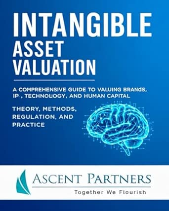

# Intangible Asset Valuation: A Comprehensive Guide

<script type="application/ld+json">
{
  "@context": "https://schema.org",
  "@type": "SoftwareApplication",
  "name": "Intangible Asset Valuation",
  "description": "Python library for intangible asset valuation — patents, brands, goodwill, PPA, impairment testing. 124+ functions aligned to ASC 805, IFRS 3, ASC 350.",
  "url": "https://intangible-valuation.simonmak.com",
  "author": {
    "@type": "Organization",
    "name": "Ascent Partners",
    "url": "https://www.linkedin.com/company/ascent-partners-group-"
  },
  "license": "https://opensource.org/licenses/MIT",
  "applicationCategory": "FinanceApplication",
  "operatingSystem": "Any",
  "programmingLanguage": "Python",
  "runtimePlatform": "Python 3.11+",
  "softwareVersion": "1.0.0",
  "downloadUrl": "https://pypi.org/project/intangible-valuation/",
  "codeRepository": "https://github.com/simonplmak-cloud/intangible-valuation",
  "keywords": ["intangible asset valuation", "patent valuation", "brand valuation", "goodwill", "purchase price allocation", "PPA", "impairment testing", "ASC 805", "IFRS 3", "relief from royalty", "MPEEM", "MCP server", "AI valuation"],
  "offers": {
    "@type": "Offer",
    "price": "0",
    "priceCurrency": "USD"
  }
}
</script>

<div class="book-hero">
  <div class="book-cover">
    
  </div>
  <div class="book-info">
    <h2>Intangible Asset Valuation</h2>
    <p class="book-subtitle">A Comprehensive Guide to Valuing Brands, IP, Technology, and Human Capital</p>
    <p class="book-subtitle-2">Theory, Methods, Regulation, and Practice</p>
    <p class="book-series">Valuation in Practice Series by Ascent Partners</p>
    <p class="book-author">By Simon Mak</p>
    <p class="book-description">
      The definitive textbook for finance professionals, valuation analysts, accountants, and students navigating the complexities of intangible asset valuation. Covers all three valuation approaches, 19 chapters of frameworks for patents, trademarks, brands, technology, customer relationships, goodwill, purchase price allocation, and impairment testing — with step-by-step methodologies aligned to ASC 805, IFRS 3, ASC 350, and IAS 36.
    </p>
    <p class="book-features">
      19 chapters · 3 appendices · 124+ functions · 1056 tests · 49 MCP tools · 3 AI-Agent Skills
    </p>
    <a href="https://www.amazon.com/Intangible-Asset-Valuation-Comprehensive-Technology/dp/B0FZ8742R1" class="amazon-btn" target="_blank" rel="noopener">
      Buy on Amazon
    </a>
  </div>
</div>

## Companion Library

This site is the companion documentation for the Python library implementing **124+ functions** from the Intangible Asset Valuation textbook.

## Quick Start

```bash
pip install intangible-valuation
```

```python
from intangible_valuation.core.time_value import present_value
from intangible_valuation.income_methods.relief_from_royalty import relief_from_royalty

# Present Value
result = present_value(future_value=500_000, discount_rate=0.10, periods=8)
print(f"PV: ${result.value:,.2f}")  # $233,253.69

# Relief from Royalty — Patent Valuation
value = relief_from_royalty(
    revenue_projections=[1_000_000, 1_100_000, 1_200_000, 1_300_000, 1_400_000],
    royalty_rate=0.05,
    discount_rate=0.12,
    tax_rate=0.25,
    useful_life=5,
)
print(f"Patent value: ${value.value:,.2f}")
```

## Book Chapters → Library Modules

| Chapter | Topic | Library Module |
|---------|-------|----------------|
| 1 | Introduction to Intangible Assets | — |
| 2 | Core Mathematics | `core.time_value`, `core.discount_rate`, `core.statistics` |
| 3 | Valuation Approaches | `approaches.cost`, `approaches.market` |
| 4 | Income Methods | `income_methods.relief_from_royalty`, `income_methods.mpeem`, `income_methods.incremental_cash_flow` |
| 5 | Intellectual Property | `asset_types.patent`, `asset_types.trademark`, `asset_types.copyright`, `asset_types.trade_secret` |
| 6 | Royalty Analysis | `advanced.royalty` |
| 7 | Technology Assets | `asset_types.technology`, `asset_types.software`, `asset_types.data`, `asset_types.platform` |
| 8 | Customer-Related Intangibles | `asset_types.customer_relationship`, `asset_types.distribution_network`, `asset_types.non_compete` |
| 9 | Human Capital | `asset_types.assembled_workforce`, `asset_types.key_person` |
| 10 | Goodwill & PPA | `advanced.goodwill`, `advanced.purchase_price_alloc` |
| 11 | Impairment Testing | `advanced.impairment` |
| 12–14 | Advanced Topics | `advanced.monte_carlo`, `advanced.decision_tree`, `advanced.litigation`, `advanced.transfer_pricing` |
| 15–19 | Specialized & International | See textbook |

## Features

- **124+ valuation functions** across all three approaches covering every methodology in the textbook
- **Typed Python API** with structured `ValuationResult` returns (value + assumptions + step-by-step calculation)
- **MCP Server** exposing 49 valuation tools for AI agents (Claude, OpenCode, etc.)
- **AI-Agent Skills** with workflow guidance for asset valuation, discount rate construction, and PPA
- **1056 tests** — every function verified against textbook example values

## Modules

| Module | Methods | Chapter |
|--------|---------|---------|
| `core.time_value` | PV, FV, annuity, perpetuity, growing annuity, terminal value | 2 |
| `core.discount_rate` | Build-up, CAPM, WACC, TAB, control premium, DLOM, currency adjustment | 2 |
| `core.statistics` | Monte Carlo, decision trees, regression | 2 |
| `approaches.cost` | Reproduction cost, replacement cost | 3 |
| `approaches.market` | Comparable transactions, royalty capitalization | 3 |
| `income_methods.relief_from_royalty` | RFR with TAB | 4 |
| `income_methods.mpeem` | Multi-period excess earnings with CACs | 4 |
| `income_methods.incremental_cash_flow` | With vs. without asset comparison | 4 |
| `asset_types.*` | IP, brand, technology, customer, human capital | 5–9 |
| `advanced.royalty` | Benchmarking, 25% rule, adjustment | 6 |
| `advanced.goodwill` | Goodwill calculation, PPA waterfall | 10 |
| `advanced.impairment` | Goodwill & intangible impairment (ASC 350 / IAS 36) | 11 |
| `advanced.monte_carlo` | Simulation, sensitivity analysis | 15 |
| `advanced.decision_tree` | Backward induction | 16 |
| `advanced.litigation` | Lost profits, pre-judgment interest | 17 |
| `advanced.transfer_pricing` | CUP method, OECD guidelines | 18 |

## MCP Server

```bash
pip install intangible-valuation[mcp]
intangible-valuation-mcp
```

Connect with any MCP-compatible AI agent. All 49 valuation tools are available.

## AI-Agent Skills

Copy the `skills/` directory to your agent's skills folder. Available skills:
- `asset-valuation` — Patents, trademarks, technology, customer relationships, human capital
- `discount-rate-construction` — Build-up, CAPM, WACC, risk premiums, adjustments
- `purchase-price-allocation` — Full PPA workflow, goodwill calculation, impairment testing

## Development

```bash
pip install -e ".[dev]"
pytest --cov=src --cov-report=term-missing
ruff check .
```

## License

MIT
